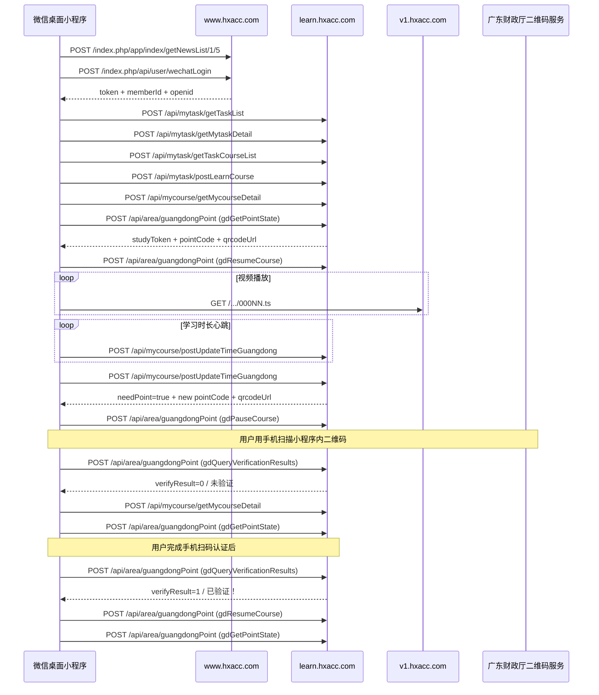

# 调用时序

## 分阶段时序

### 阶段 1：启动与登录

1. `POST www.hxacc.com/index.php/app/index/getNewsList/1/5`
2. `POST www.hxacc.com/index.php/api/user/wechatLogin`

### 阶段 2：进入专业课

3. `POST learn.hxacc.com/api/mytask/getTaskList`
4. `POST learn.hxacc.com/api/mytask/getTaskList`
5. `POST learn.hxacc.com/api/mytask/getMytaskDetail`
6. `POST learn.hxacc.com/api/mytask/getTaskCourseList`
7. `POST learn.hxacc.com/api/mytask/postLearnCourse`
8. `POST learn.hxacc.com/api/mycourse/getMycourseDetail`

### 阶段 3：开始广东学习监管

9. `POST learn.hxacc.com/api/area/guangdongPoint`（`gdGetPointState`）
10. `POST learn.hxacc.com/api/area/guangdongPoint`（`gdResumeCourse`）

### 阶段 4：视频播放

11. 约每 10 秒一次 `GET v1.hxacc.com/.../000NN.ts`

### 阶段 5：学习时长心跳

12. 约每 60 秒一次 `POST learn.hxacc.com/api/mycourse/postUpdateTimeGuangdong`

### 阶段 6：二维码认证触发与暂停

13. 14:13:24 心跳响应返回 `needPoint: true` 和 `qrcodeUrl`
14. `POST learn.hxacc.com/api/area/guangdongPoint`（`gdPauseCourse`）

### 阶段 7：认证结果查询

15. `POST learn.hxacc.com/api/area/guangdongPoint`（`gdQueryVerificationResults`）
16. `POST learn.hxacc.com/api/mycourse/getMycourseDetail`
17. `POST learn.hxacc.com/api/area/guangdongPoint`（`gdGetPointState`）

### 阶段 8：002.chlz 中的认证成功闭环

18. `POST learn.hxacc.com/api/mycourse/getMycourseDetail`
19. `POST learn.hxacc.com/api/area/guangdongPoint`（`gdGetPointState`）
20. `POST learn.hxacc.com/api/area/guangdongPoint`（`gdQueryVerificationResults`，返回“已验证！”）
21. `POST learn.hxacc.com/api/mycourse/getMycourseDetail`
22. `POST learn.hxacc.com/api/area/guangdongPoint`（`gdResumeCourse`）
23. `POST learn.hxacc.com/api/area/guangdongPoint`（`gdGetPointState`）

## Mermaid 时序图

